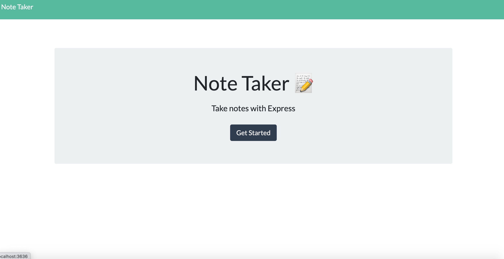
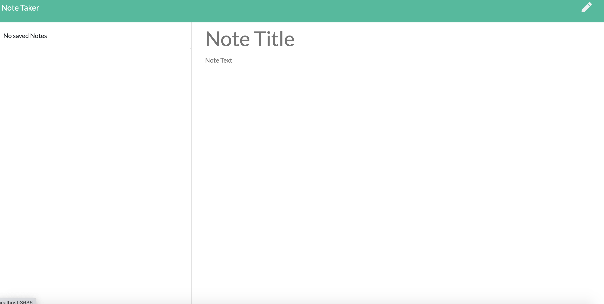
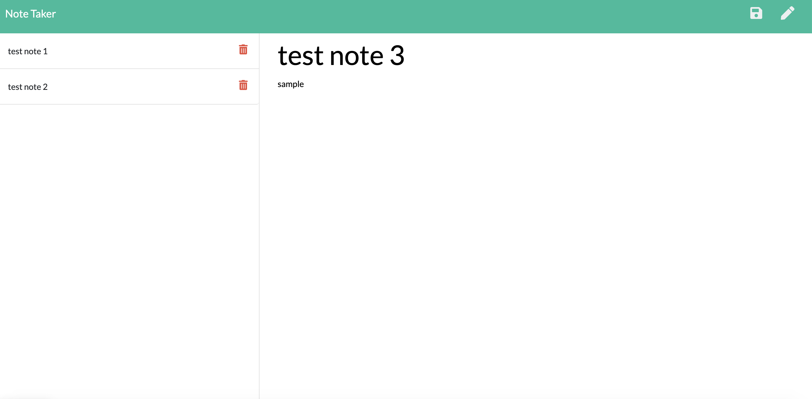

# Note Taker

## Description

This project is a note taker app for users to write a note and save it to the aside on the left of the page oncee it is created it can be deleted. Technologies used to create this are node.js, and I used the npm express package. I had a very difficult time with the api routes. The app.delete does work with a minor bug. Attached is a link to the deployed app on heroku. <a href="https://sleepy-harbor-54323.herokuapp.com/">    DEPLOY APP</a>

# Questions
If you have any questions about the repo, open an issue or contact me directly at magoldstein93@gmail.com. You can find more of my work on my GitHub maxgoldstein93.

